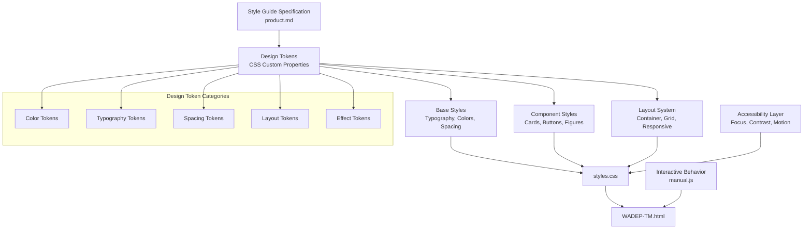
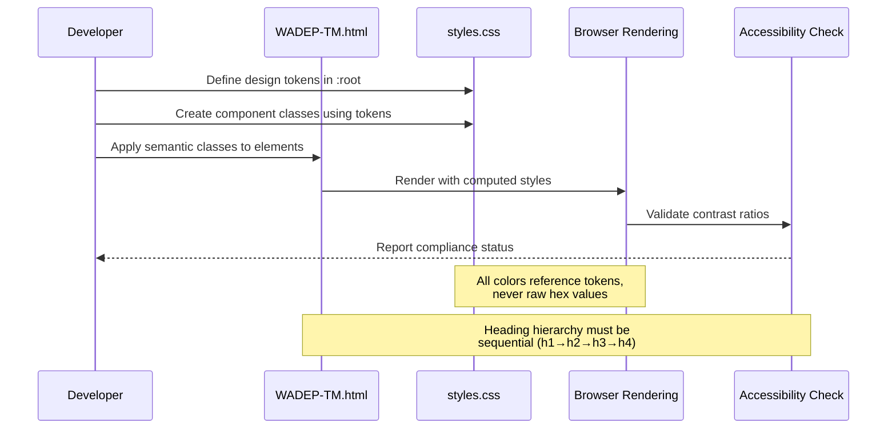
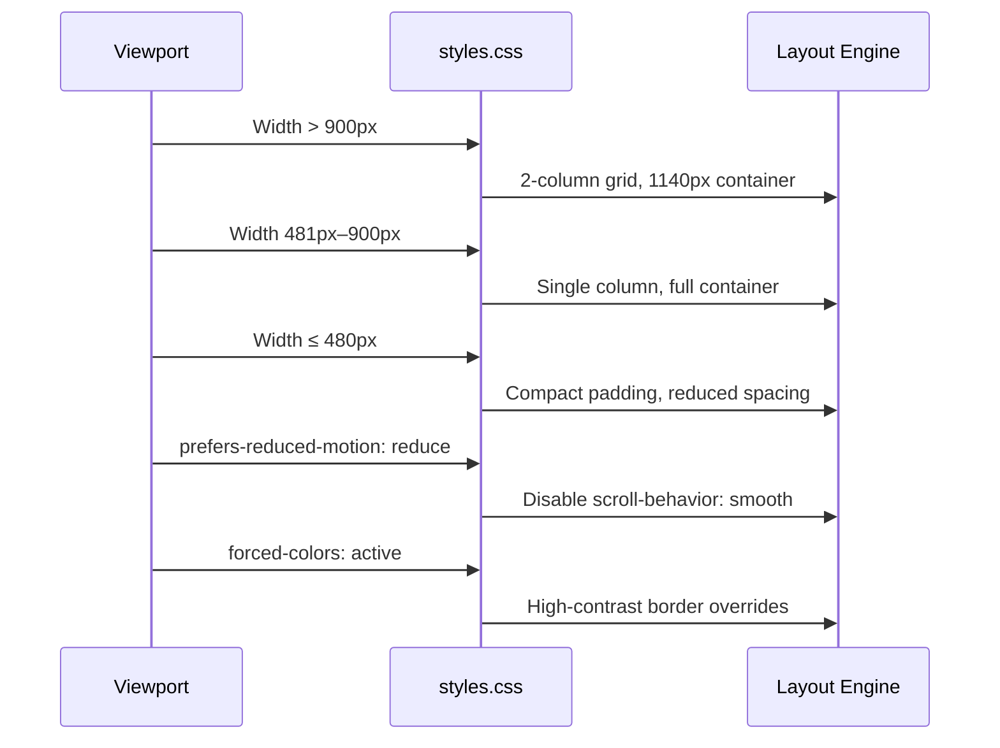

# Design Document: WADEPS Website Style Guide

## Overview

This design formalizes the inferred WADEPS Website Style Guide into a structured, enforceable design system for the WADEPS Reporting Tool Training Manual HTML project. The style guide covers brand identity, color tokens, typography, layout, iconography, buttons/links, accessibility rules, content style, data presentation, and footer/partner branding.

The implementation targets the existing `styles.css` (CSS custom properties architecture), `WADEP-TM.html` (semantic HTML structure), and `manual.js` (interactive accessibility features). The goal is to ensure every visual and structural element in the training manual aligns with the WADEPS brand identity — public-sector, institutional, data-focused, and accessibility-forward — while maintaining WCAG 2.1 AA compliance throughout.

The design system is intentionally lightweight: a single CSS file with well-organized custom properties, semantic class naming, and documented component patterns. No build tools or preprocessors are required, keeping the project self-contained and easy to maintain by non-frontend specialists in law enforcement agencies.

## Architecture



## Sequence Diagrams

### Style Guide Validation Flow



### Responsive Breakpoint Cascade



## Components and Interfaces

### Component 1: Design Token System

**Purpose**: Centralized source of truth for all visual values. Every color, font size, spacing unit, and effect references a CSS custom property rather than a raw value.

**Interface**:
```css
:root {
  /* Color Tokens — Brand */
  --wadeps-green-dark: #1f4f3a;
  --wadeps-green: #2f6f4e;
  --wadeps-green-light: #5f9f6e;
  
  /* Color Tokens — Neutral */
  --white: #ffffff;
  --off-white: #f7f7f4;
  --text-dark: #1f252b;
  --text-muted: #4b5563;
  --border-light: #d9ded8;
  
  /* Color Tokens — Semantic */
  --link-blue: #005ea8;
  --focus-ring: #ffbf47;
  --info-surface: #eef5fb;
  --warning-surface: #fcf2ec;
  --success-surface: #eef6ef;
  --scenario-surface: #fff8e8;
  
  /* Color Tokens — Partner */
  --wsu-crimson-accent: #981e32;
  
  /* Typography Tokens */
  --font-heading: 'Montserrat', Helvetica, sans-serif;
  --font-body: 'Open Sans', Arial, sans-serif;
  --font-size-base: 1rem;
  --font-size-sm: 0.9rem;
  --font-size-lg: 1.125rem;
  --font-size-xl: 1.25rem;
  --line-height-body: 1.6;
  --line-height-heading: 1.25;
  --font-weight-normal: 400;
  --font-weight-bold: 700;
  
  /* Spacing Tokens */
  --space-1: 0.5rem;
  --space-2: 0.75rem;
  --space-3: 1rem;
  --space-4: 1.5rem;
  --space-5: 2rem;
  --space-6: 3rem;
  --space-7: 4rem;
  
  /* Layout Tokens */
  --container-max: 1140px;
  --container-padding: 1.5rem;
  --grid-gap: 1.5rem;
  --radius: 0.75rem;
  --radius-sm: 0.25rem;
  --radius-pill: 999px;
  
  /* Effect Tokens */
  --shadow-card: 0 10px 30px rgba(31, 37, 43, 0.08);
  --shadow-elevated: 0 4px 16px rgba(31, 37, 43, 0.05);
  --shadow-button: 0 4px 12px rgba(0, 0, 0, 0.18);
  --transition-fast: 0.2s ease;
}
```

**Responsibilities**:
- Single source of truth for all visual values
- Enable theme consistency across all components
- Support text-size scaling via CSS custom property overrides
- Provide semantic naming that communicates intent

### Component 2: Typography System

**Purpose**: Enforce the WADEPS heading hierarchy and body text rules across the training manual.

**Interface**:
```css
/* Heading hierarchy — sequential, never skip levels */
h1 { font-family: var(--font-heading); font-size: clamp(2rem, 4vw, 2.75rem); }
h2 { font-family: var(--font-heading); font-size: clamp(1.5rem, 3vw, 2rem); }
h3 { font-family: var(--font-heading); font-size: clamp(1.2rem, 2.4vw, 1.5rem); }
h4 { font-family: var(--font-heading); font-size: 1rem; }

/* Body text */
body { font-family: var(--font-body); font-size: var(--font-size-base); line-height: var(--line-height-body); }

/* Prose constraint */
p, li { max-width: 72ch; }
```

**Responsibilities**:
- Enforce sequential heading hierarchy (h1 → h2 → h3 → h4)
- Apply Montserrat for headings, Open Sans for body
- Maintain readable line lengths (max 72ch)
- Support responsive scaling via clamp()
- Support user text-size preferences via custom property overrides

### Component 3: Layout System

**Purpose**: Provide the traditional public-information layout structure with responsive behavior.

**Interface**:
```css
.container {
  width: min(100% - 2 * var(--container-padding), var(--container-max));
  margin: 0 auto;
}

.section { padding: var(--space-6) 0; }

.card-grid {
  display: grid;
  grid-template-columns: repeat(auto-fit, minmax(280px, 1fr));
  gap: var(--grid-gap);
}
```

**Responsibilities**:
- Center content within 1140px max-width container
- Provide consistent section spacing
- Support responsive grid layouts
- Handle mobile-first breakpoints (480px, 768px, 900px)

### Component 4: Button and Link System

**Purpose**: Ensure all interactive elements are accessible, descriptive, and visually consistent with WADEPS branding.

**Interface**:
```css
.button-primary {
  background: var(--wadeps-green-dark);
  color: var(--white);
  padding: 0.75rem 1.25rem;
  border-radius: var(--radius-sm);
  font-weight: var(--font-weight-bold);
  text-decoration: none;
  min-width: 44px;
  min-height: 44px;
}

.button-primary:hover { background: var(--wadeps-green); }
.button-primary:focus { outline: 3px solid var(--focus-ring); outline-offset: 2px; }

a {
  color: var(--link-blue);
  text-decoration: underline;
  text-underline-offset: 0.16em;
}
```

**Responsibilities**:
- Minimum 44×44px touch targets
- Visible focus states on all interactive elements
- Descriptive link text (never "click here" alone)
- External link indicators with screen-reader text
- Consistent hover/focus/active states

### Component 5: Accessibility Layer

**Purpose**: Enforce WCAG 2.1 AA compliance across all components.

**Interface**:
```css
/* Focus management */
:focus-visible { outline: 3px solid var(--focus-ring); outline-offset: 3px; }

/* Screen-reader only utility */
.sr-only { position: absolute; width: 1px; height: 1px; /* ... clip */ }

/* Skip navigation */
.skip-link { /* visible on focus, hidden otherwise */ }

/* Reduced motion */
@media (prefers-reduced-motion: reduce) { html { scroll-behavior: auto; } }

/* High contrast mode */
@media (forced-colors: active) { /* border overrides for visibility */ }
```

**Responsibilities**:
- Visible focus indicators on all focusable elements
- Skip-to-content link for keyboard users
- Screen-reader announcements for dynamic changes
- Respect prefers-reduced-motion
- Support Windows High Contrast mode
- Maintain minimum 4.5:1 contrast ratio for text
- Maintain minimum 3:1 contrast ratio for UI components

## Data Models

### Model 1: Color Token Map

```css
/* Token naming convention: --{category}-{variant} */
/* Categories: wadeps, text, surface, border, link, focus, info, warning, success, scenario */

:root {
  /* Brand greens — primary identity */
  --wadeps-green-dark: #1f4f3a;   /* Headers, primary buttons, borders */
  --wadeps-green: #2f6f4e;        /* Hover states, accents */
  --wadeps-green-light: #5f9f6e;  /* Decorative, light accents */
  
  /* Text hierarchy */
  --text-dark: #1f252b;           /* Body text, primary content */
  --text-muted: #4b5563;          /* Secondary text, metadata */
  
  /* Surfaces */
  --surface: #f7f7f4;             /* Section backgrounds */
  --surface-alt: #f1f4f1;         /* Alternate card backgrounds */
  --surface-strong: #edf2ec;      /* Emphasized surfaces */
}
```

**Validation Rules**:
- All color tokens must pass WCAG 2.1 AA contrast when used as text on their intended background
- `--text-dark` on `--white` must achieve ≥ 7:1 (AAA)
- `--text-dark` on `--surface` must achieve ≥ 4.5:1 (AA)
- `--white` on `--wadeps-green-dark` must achieve ≥ 4.5:1 (AA)
- `--link-blue` on `--white` must achieve ≥ 4.5:1 (AA)

### Model 2: Typography Scale

```css
/* Type scale based on style guide recommendations */
/* Heading: Montserrat 700 | Body: Open Sans 400 */

--h1-size: clamp(2rem, 4vw, 2.75rem);      /* ~32px–44px */
--h2-size: clamp(1.5rem, 3vw, 2rem);       /* ~24px–32px */
--h3-size: clamp(1.2rem, 2.4vw, 1.5rem);   /* ~19px–24px */
--h4-size: 1rem;                             /* 16px */
--body-size: 1rem;                           /* 16px */
--small-size: 0.9rem;                        /* ~14px */
```

**Validation Rules**:
- Headings must use `--font-heading` (Montserrat)
- Body text must use `--font-body` (Open Sans)
- Line height for body: 1.6 minimum
- Line height for headings: 1.25
- No font size below 14px (0.875rem) for readability

### Model 3: Spacing Scale

```css
/* 8px-based spacing scale */
--space-1: 0.5rem;   /* 8px — tight gaps */
--space-2: 0.75rem;  /* 12px — element margins */
--space-3: 1rem;     /* 16px — paragraph spacing */
--space-4: 1.5rem;   /* 24px — component padding */
--space-5: 2rem;     /* 32px — section gaps */
--space-6: 3rem;     /* 48px — major sections */
--space-7: 4rem;     /* 64px — page-level spacing */
```

**Validation Rules**:
- All spacing values must use token references, not raw values
- Component internal padding: minimum `--space-3`
- Section vertical spacing: minimum `--space-5`
- Touch targets: minimum 44×44px (2.75rem)

## Algorithmic Pseudocode

### Style Guide Compliance Validation Algorithm

```pascal
ALGORITHM validateStyleGuideCompliance(document)
INPUT: document (HTML DOM tree)
OUTPUT: complianceReport (list of violations)

BEGIN
  violations ← empty list
  
  // Rule 1: Heading hierarchy must be sequential
  headings ← document.querySelectorAll("h1, h2, h3, h4, h5, h6")
  previousLevel ← 0
  
  FOR each heading IN headings DO
    currentLevel ← heading.tagName level (1-6)
    
    IF currentLevel > previousLevel + 1 THEN
      violations.add("Skipped heading level: h" + previousLevel + " → h" + currentLevel)
    END IF
    
    previousLevel ← currentLevel
  END FOR
  
  // Rule 2: All images must have alt text
  images ← document.querySelectorAll("img")
  
  FOR each image IN images DO
    IF image.alt IS empty AND image.role ≠ "presentation" THEN
      violations.add("Image missing alt text: " + image.src)
    END IF
  END FOR
  
  // Rule 3: Links must have descriptive text
  links ← document.querySelectorAll("a")
  
  FOR each link IN links DO
    linkText ← link.textContent.trim()
    
    IF linkText IN ["click here", "here", "link", "read more"] THEN
      violations.add("Non-descriptive link text: " + linkText)
    END IF
    
    IF link.target = "_blank" AND NOT link.contains(".sr-only") THEN
      violations.add("External link missing screen-reader indicator: " + linkText)
    END IF
  END FOR
  
  // Rule 4: Color tokens must be used (no raw hex in component styles)
  stylesheets ← document.styleSheets
  
  FOR each rule IN stylesheets DO
    IF rule.value matches /#[0-9a-f]{3,8}/i AND rule.selector ≠ ":root" THEN
      violations.add("Raw color value used outside :root: " + rule.selector)
    END IF
  END FOR
  
  // Rule 5: Focus states must exist for interactive elements
  interactiveElements ← document.querySelectorAll("a, button, input, select, textarea")
  
  FOR each element IN interactiveElements DO
    focusStyle ← getComputedStyle(element, ":focus-visible").outline
    
    IF focusStyle IS "none" OR focusStyle IS empty THEN
      violations.add("Missing focus style: " + element.tagName + "." + element.className)
    END IF
  END FOR
  
  RETURN violations
END
```

**Preconditions:**
- Document is a valid HTML5 document
- Stylesheets are loaded and accessible via CSSOM

**Postconditions:**
- Returns a list of all style guide violations found
- Empty list indicates full compliance
- Each violation includes a human-readable description

### Color Contrast Validation Algorithm

```pascal
ALGORITHM validateContrastRatio(foreground, background)
INPUT: foreground (hex color), background (hex color)
OUTPUT: passes (boolean), ratio (number)

BEGIN
  // Convert hex to relative luminance
  fgLuminance ← relativeLuminance(foreground)
  bgLuminance ← relativeLuminance(background)
  
  // Calculate contrast ratio per WCAG 2.1
  lighter ← MAX(fgLuminance, bgLuminance)
  darker ← MIN(fgLuminance, bgLuminance)
  ratio ← (lighter + 0.05) / (darker + 0.05)
  
  // AA requires 4.5:1 for normal text, 3:1 for large text
  passes ← ratio >= 4.5
  
  RETURN (passes, ratio)
END

ALGORITHM relativeLuminance(hexColor)
INPUT: hexColor (string "#RRGGBB")
OUTPUT: luminance (number 0-1)

BEGIN
  r ← parseHexChannel(hexColor, 0) / 255
  g ← parseHexChannel(hexColor, 1) / 255
  b ← parseHexChannel(hexColor, 2) / 255
  
  // Apply sRGB linearization
  rLinear ← IF r <= 0.03928 THEN r / 12.92 ELSE ((r + 0.055) / 1.055) ^ 2.4
  gLinear ← IF g <= 0.03928 THEN g / 12.92 ELSE ((g + 0.055) / 1.055) ^ 2.4
  bLinear ← IF b <= 0.03928 THEN b / 12.92 ELSE ((b + 0.055) / 1.055) ^ 2.4
  
  luminance ← 0.2126 * rLinear + 0.7152 * gLinear + 0.0722 * bLinear
  
  RETURN luminance
END
```

**Preconditions:**
- Colors are valid 6-digit hex strings
- Both foreground and background colors are provided

**Postconditions:**
- Returns boolean pass/fail and numeric ratio
- Ratio is always ≥ 1.0
- Passes is true when ratio ≥ 4.5 (AA normal text)

## Key Functions with Formal Specifications

### Function 1: applyDesignTokens()

```css
/* Applied via :root custom properties — no function call needed */
/* The browser resolves var() references at computed-value time */
:root { /* all tokens defined here */ }
```

**Preconditions:**
- Browser supports CSS Custom Properties (CSS Variables)
- `:root` selector is present in stylesheet

**Postconditions:**
- All `var()` references resolve to valid CSS values
- No `var()` reference is undefined (would fall back to initial value)
- Token values match the style guide specification

### Function 2: setTextSize(size)

```javascript
function setTextSize(size) {
  // size ∈ {"default", "large", "extra-large"}
  const nextSize = validSizes.has(size) ? size : "default";
  document.body.setAttribute("data-text-size", nextSize);
  localStorage.setItem("manualTextSize", nextSize);
  // Update aria-pressed on all size buttons
  buttons.forEach(btn => {
    btn.setAttribute("aria-pressed", String(btn.dataset.textSize === nextSize));
  });
  announceToScreenReader(`Text size set to ${nextSize.replace("-", " ")}`);
}
```

**Preconditions:**
- `size` is a string (may be any value)
- `validSizes` Set contains exactly: "default", "large", "extra-large"
- DOM is loaded (DOMContentLoaded has fired)

**Postconditions:**
- `document.body.dataset.textSize` equals a valid size
- Exactly one button has `aria-pressed="true"`
- localStorage contains the selected size
- Screen reader announces the change

**Loop Invariants:**
- For the buttons.forEach loop: all previously processed buttons have correct aria-pressed value

### Function 3: validateHeadingHierarchy(container)

```javascript
function validateHeadingHierarchy(container) {
  const headings = container.querySelectorAll("h1, h2, h3, h4, h5, h6");
  const violations = [];
  let prevLevel = 0;
  
  headings.forEach(heading => {
    const level = parseInt(heading.tagName[1]);
    if (level > prevLevel + 1) {
      violations.push({ element: heading, skippedFrom: prevLevel, skippedTo: level });
    }
    prevLevel = level;
  });
  
  return violations;
}
```

**Preconditions:**
- `container` is a valid DOM element
- Headings use standard h1–h6 tags

**Postconditions:**
- Returns array of violation objects (empty if compliant)
- Each violation identifies the heading element and the skip
- Does not modify the DOM

## Example Usage

### Using Design Tokens in Component Styles

```css
/* Correct: reference tokens */
.chapter-header {
  color: var(--wadeps-green-dark);
  font-family: var(--font-heading);
  margin-bottom: var(--space-4);
}

/* Incorrect: raw values */
.chapter-header {
  color: #1f4f3a;          /* ✗ Use --wadeps-green-dark */
  font-family: Montserrat; /* ✗ Use --font-heading */
  margin-bottom: 1.5rem;   /* ✗ Use --space-4 */
}
```

### Accessible Link Pattern

```html
<!-- Correct: descriptive link text with external indicator -->
<a href="https://wadeps.org/dashboard" target="_blank" rel="noopener">
  View the WADEPS Dashboard
  <span class="sr-only">(opens in a new window)</span>
</a>

<!-- Incorrect: non-descriptive text, no external indicator -->
<a href="https://wadeps.org/dashboard" target="_blank">Click here</a>
```

### Responsive Component Pattern

```css
/* Mobile-first, progressive enhancement */
.manual-cover {
  display: grid;
  gap: var(--space-5);
  padding: var(--space-4);
}

@media (min-width: 900px) {
  .manual-cover {
    grid-template-columns: minmax(0, 1.1fr) minmax(18rem, 0.9fr);
  }
}
```

### Text Size Scaling Integration

```css
/* Tokens respond to data-text-size attribute */
body[data-text-size="default"] { --body-font-size: 1rem; --line-height: 1.6; }
body[data-text-size="large"] { --body-font-size: 1.125rem; --line-height: 1.7; }
body[data-text-size="extra-large"] { --body-font-size: 1.25rem; --line-height: 1.8; }
```

## Correctness Properties

The following properties must hold for any valid implementation of the WADEPS style guide:

### Property 1: Token Completeness

∀ CSS rule R outside `:root`, if R contains a color value, then R uses a `var()` reference to a token defined in `:root`.

### Property 2: Heading Hierarchy

∀ heading H at level N in document order, if the previous heading P has level M, then N ≤ M + 1 (no skipping levels).

### Property 3: Contrast Compliance

∀ text element T with computed foreground color F and background color B, contrastRatio(F, B) ≥ 4.5 for normal text and ≥ 3.0 for large text (≥18pt or ≥14pt bold).

### Property 4: Focus Visibility

∀ interactive element E (links, buttons, inputs), E has a visible `:focus-visible` style with outline width ≥ 2px.

### Property 5: Image Accessibility

∀ `` element I, either I has a non-empty `alt` attribute describing its content, or I has `role="presentation"` / `alt=""` if decorative.

### Property 6: Link Descriptiveness

∀ `<a>` element A, A.textContent is descriptive of the destination (not "click here", "here", "link", or "read more" alone).

### Property 7: External Link Indication

∀ `<a>` element A with `target="_blank"`, A contains a `.sr-only` child indicating it opens in a new window.

### Property 8: Touch Target Size

∀ interactive element E, computed width ≥ 44px AND computed height ≥ 44px.

### Property 9: Typography Consistency

∀ heading element H, H uses `--font-heading` (Montserrat). ∀ body text element T, T uses `--font-body` (Open Sans).

### Property 10: Spacing Token Usage

∀ margin/padding value V in component styles, V references a `--space-*` token or is 0.

## Error Handling

### Error Scenario 1: Missing Font Load

**Condition**: Google Fonts CDN is unavailable or blocked by network policy
**Response**: CSS font stack falls back to system fonts (Helvetica → sans-serif for headings, Arial → sans-serif for body)
**Recovery**: No action needed — fallback fonts maintain readability. The design degrades gracefully.

### Error Scenario 2: CSS Custom Properties Unsupported

**Condition**: Browser does not support CSS Custom Properties (IE11)
**Response**: Properties resolve to their initial values; layout breaks
**Recovery**: This project targets modern browsers only. A `<noscript>` or compatibility notice could be added for legacy browsers, but IE11 support is explicitly out of scope.

### Error Scenario 3: JavaScript Disabled

**Condition**: User has JavaScript disabled
**Response**: Text size controls do not function; back-to-top button is hidden
**Recovery**: Default text size is applied via CSS. Browser zoom remains available. All content is accessible without JS — only enhancement features are lost.

### Error Scenario 4: High Contrast Mode Active

**Condition**: User has Windows High Contrast mode enabled
**Response**: `@media (forced-colors: active)` rules override borders and outlines to use system colors
**Recovery**: Automatic — the forced-colors media query ensures all borders use `CanvasText` and focus rings use `Highlight`.

### Error Scenario 5: Heading Hierarchy Violation

**Condition**: Content author skips a heading level (e.g., h2 → h4)
**Response**: Screen readers may announce incorrect document structure
**Recovery**: Validation during development catches violations. The `validateHeadingHierarchy()` function can be run as a pre-publish check.

## Testing Strategy

### Unit Testing Approach

Test individual style guide rules in isolation:

- **Color contrast tests**: For each token pair (foreground on background), compute contrast ratio and assert ≥ 4.5:1
- **Token completeness tests**: Parse `styles.css`, verify no raw hex values outside `:root`
- **Typography tests**: Verify heading elements use correct font-family token
- **Spacing tests**: Verify component padding/margin uses token references

### Property-Based Testing Approach

**Property Test Library**: N/A (CSS/HTML project — use automated accessibility testing tools)

**Automated Accessibility Testing**:
- axe-core or pa11y for WCAG 2.1 AA automated checks
- Lighthouse accessibility audit (score target: 100)
- HTML validator for semantic correctness

**Key Properties to Test**:
- For any viewport width 320px–1920px, no horizontal scrollbar appears
- For any text-size setting, all content remains readable and no overflow occurs
- For any interactive element, focus is visible with ≥ 3px outline
- For any color combination used, contrast ratio meets AA threshold

### Integration Testing Approach

- Open `WADEP-TM.html` in browser, run axe-core DevTools extension
- Keyboard-only navigation test: Tab through entire document, verify all interactive elements are reachable
- Screen reader test: Verify heading hierarchy announced correctly, images described, links descriptive
- Responsive test: Verify layout at 320px, 480px, 768px, 900px, 1140px, 1920px viewports
- Print test: Verify `@media print` rules hide interactive elements and maintain readability

## Performance Considerations

- **No external dependencies**: Fonts can be self-hosted or loaded from Google Fonts with `font-display: swap` to prevent FOIT
- **Single stylesheet**: All styles in one `styles.css` file — no CSS-in-JS overhead
- **Minimal JavaScript**: Only text-size toggle and back-to-top button — no framework
- **Image optimization**: All screenshots use `loading="lazy"` and `decoding="async"`
- **CSS containment**: Consider `contain: content` on card components for paint optimization
- **No layout shifts**: Fixed dimensions on images prevent CLS

## Security Considerations

- **No user input processing**: The training manual is read-only content
- **External links**: All use `rel="noopener"` to prevent tab-napping
- **No third-party scripts**: Self-contained document with no external JS dependencies
- **Content Security Policy**: Compatible with strict CSP (no inline styles needed beyond `data-text-size` attribute)
- **No cookies or tracking**: Only `localStorage` for text-size preference (non-sensitive)

## Dependencies

| Dependency | Purpose | Required |
|---|---|---|
| Montserrat (Google Fonts) | Heading typography | Optional (falls back to Helvetica) |
| Open Sans (Google Fonts) | Body typography | Optional (falls back to Arial) |
| Modern browser (CSS Custom Properties) | Design token system | Required |
| JavaScript (ES6+) | Text size controls, back-to-top | Optional (graceful degradation) |
| axe-core / pa11y | Accessibility testing | Development only |
| Lighthouse | Performance + accessibility audit | Development only |
